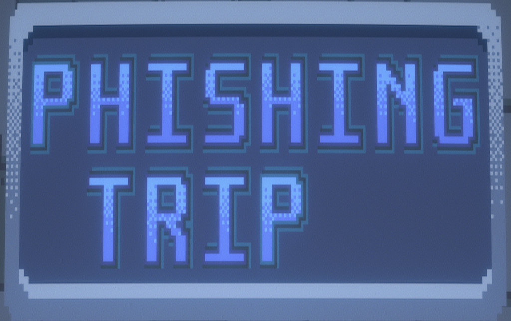

## Overview
- A Papers Please knockoff where the goal is to detect scams before you or one of your coworkers gets scammed. Completed as an entry to a cybersecurity game jam.

## Team Size/Time constraint
- Team of 4, completed in 3 weeks.

## What I did
- Wrote fake emails
- Designed scam types
- Playtester/QA

## Link to Game

https://redbluebird.itch.io/phishing-trip
