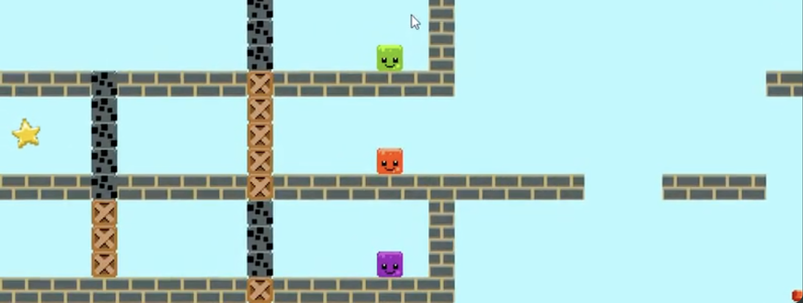

## Overview
- A 2d puzzle platformer with a v

## Team Size/Time constraint
- Team of 4, Completed in 2 weeks.

## What I did
- Level Design
- Programmed UI
- Programmed Movement/Physics (not including the blocks combining)

## Link to Repo

https://github.com/SimplyNarwall/despacito

## Examples of Work

<video width="640" height="360" controls="">
  <source src="tb.mp4" type="video/mp4" />
  Your browser does not support the video tag.
</video>

<picture>

  
</picture>

