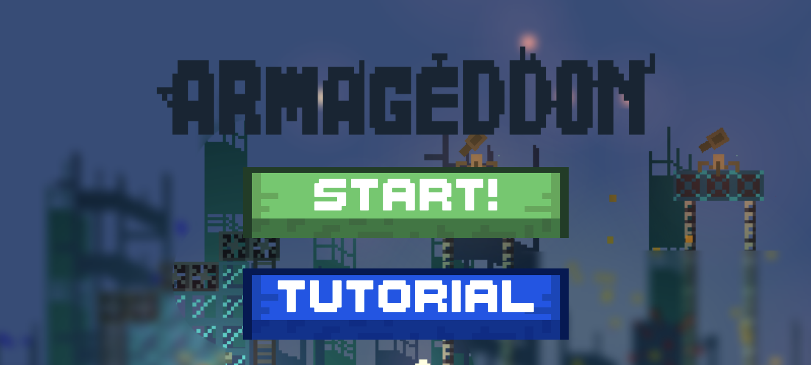

## Link to Game
https://redbluebird.itch.io/armageddon-v2

## Team Size/Time constraint
- Was a programmer in a team of 4. Finished in 2 weeks.

## What I did
- Programmed Weapon Types
- Programmed Bullet Manager
- Designed some levels

## Game Overview
- Armageddon is a fast-paced 2d metroidvania game where the screen is constantly scrolling and you must reach the end of the level while avoiding, or defeating all obstacles in your path. A core mechanic of this game is the ability to destroy all bullets on screen upon defeating an enemy, incentivizing the player to defeat enemies.

