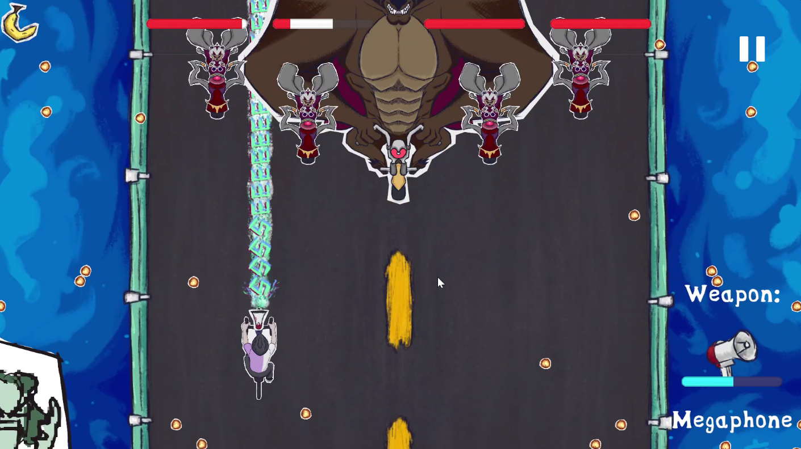

## Overview
- Bike the Bullet is a fast-paced 2d shoot em' up created in 3 for MonkeyJam2024. You play as popular Twitch Streamer CDawgVA and you have been tasked by the God of Bike to defeat Boss Grizzle and his goons. With anthromorphic animals and bikes and weapons/voicelines inspired by Connor and his friends, Bike the Bullet is a short but fun and challenging time waster.

## Team Size/Time constraint
- Worked as the a programmer and designer in a team of 4, for a 3 day Game Jam.

## What I did
- Wrote GDD summary
- Designed weapon types
- Designed enemy movement/attack patterns
- Programmed entire game with the exception of 2 minor enemy types and the enemy spawn timings.

## Link to Game

https://n0va-0.itch.io/bike-the-bullet
