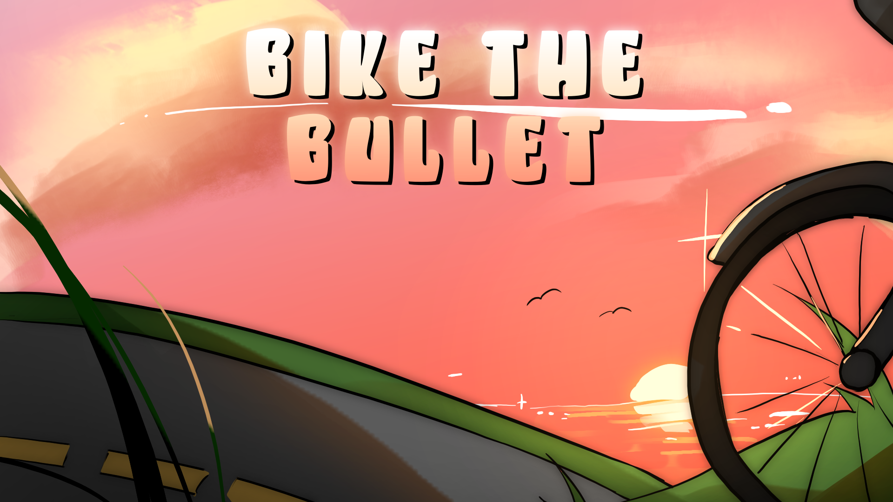

## Overview
- Bike the Bullet is a fast-paced 2d shoot em' up created for MonkeyJam2024. You play as popular Twitch Streamer CDawgVA and you have been tasked by the God of Bike to defeat Boss Grizzle and his goons. With anthromorphic animals and bikes and weapons/voicelines inspired by Connor and his friends, Bike the Bullet is a short but fun and challenging time waster.

## Link to Game

https://n0va-0.itch.io/bike-the-bullet

## Team Size/Time constraint
- Worked as the lead programmer and designer in a team of 4, for a 3 day Game Jam.

## What I did
- Wrote GDD summary
- Designed weapon types, enemy movement and attack patterns
- Programmed nearly the entire game using Unity.
- Led team by assigning tasks and organizing work/design meetings

## Gameplay Samples

Player collects a power up to give them a new explosive attack based on Chris Broad, a friend of CDawgVA with an obsession with fried chicken.

The player defeats a minion, and the boss throws the now vacant motorcycle at them

  
  

After all of the boss' minions are dead, they take matters into their own hands

## GDD
Here is are the rough design documents I created while developing the game.

<embed src="Monkey Jam 2024 GDD - Google Docs.pdf" type="application/pdf" width="892" height="842"/>
