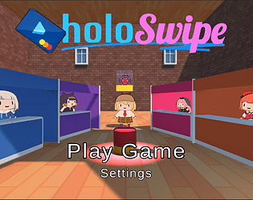
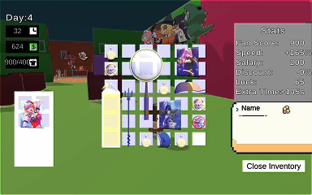

## Link to Game

https://charliedreemur.itch.io/holoswipe

## Team Size/Time constraint
- Worked as a programmer and designer in a team of 4, for a 2 week long Game Jam.

## What I did
- Wrote initial game concept summary
- Programmed disasters, loot drops, player stats, UI, and Sound
- Designed and balanced player stats, items, and disasters

## Game Overview
- Holoswipe is a fast-paced 3d roguelike where the objective is to survive one week as an obsessed Hololive Fan. Each day you must buy run around booths to collect coins and buy enough merch to prove your allegiance. Merch items give you stats in return which can increase your income, discount items, or help you avoid money-stealing disasters. 

## Gameplay Design
- The goal of the game is to get enough fan score each day to reach the next day. This is similar to games like balatro, where the only objective is to get your score high enough to win.

- Money: Players obtain money in 2 ways, through coins which spawn randomly and frequently around the map and salary, a flat sum of money which is 

- Items: Items will spawn in set areas in the map, and can be bought with money. With some exceptions, item spawns will always be random, though the location they spawn is the same each time. Items are the core of the gameplay, and the only way for players to increase their stats and fanscore enough to reach the target. The goal of random item spawns is to offer a different experience/item build for multiple playthroughs.

- Limited inventory: Players have a limited space to hold items, and players can organize their inventory to hold more. This allows for a slight optimization minigame, as well as providing for more item balancing levers (items that are cheaper are stronger earlier on when inventory space isn't an issue, whereas items that take up less space are more useful later when the player has a strong economy built). Additionally, it's simply cool to see the item sprites in your inventory. 

- Disasters: Disasters are thematic events which can impede the player's movement, or steal their money. These are mainly intended to keep players on their toes and moving all the time, increasing tension, as well as providing homage to Hololive members.

- Loot spawns: Loot spawns are the counterpart to disasters. Since the player can simply leave the convention early if they want, these loot spawns incentivize the player to stay in the convention for as long as they can, as well as providing exciting moments where players can be dropped expensive items.

- Time limit: Each day, there is a time limit before the player will be chased out by enemies which get increasingly faster and deduct a large sum of money if they reach. The idea behind these enemies is to allow a slight bit of leeway to the player, as well as letting players to feel how much "stronger" they are later in the game. Since the enemies slowly scale up their speed, high speed builds will be able to run from them for longer, and create fun moments.

## Item Balance
- Overall philosophy: While testing, I found that there were numerous times where the best strategy was simply amassing a large sum of fan score through items (As opposed to other items which offer other stats in addition such as luck, movespeed, or discount). While optimal, it felt terrible, as the items the player would buy would keep them at near base stats throughout the entire playthrough, resulting in them feeling the same at the end of the game as they do at the start. Because of this, a lot of the stat allocation and balancing is intended to incentivize players to get a wide variety of stats so they feel much stronger by the end, almost as though they're cheating compared to the start. Most viable builds will include comically high speed, enough luck to make it rain loot, or so much discount that items are practically free, allowing for a satisfying sense of progression.

- Posters and pins: special items which give increased stats based on the other items in your inventory. These are the cruxes of our archetypes, and powerful items which players should feel happy to build around.

- Plushies: Items which always spawn in the same location and give pure fanscore. These are intentionally extremely understatted for 2 reasons: The fact that these always spawn means that they would reduce variation and replayability. Additionally, since they don't give any stat other than fanscore, they don't make the player feel any stronger. However, they are useful later on, as they take up very little space, and players who have an excess of money can buy them to fill in their empty inventory slots efficiently.

