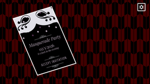

## Link to Game

https://simplynarwall.itch.io/is-this-mask-taken

## Team Size/Time constraint
- Main programmer and game designer in team of 3. Made in 48 hours for a game jam.

## What I did
- Programmed the vast majority of the game, including:
  - The seating system and checking every person's preferences against the current arrangement
  - The mask system, which swaps a person's traits and preferences when a mask is placed on them
  - Level loading and win detection
- Designed the levels, including themed puzzles based on The Last Supper, Caesar, and Phantom of the Opera

## Game Overview
- Is This Mask Taken? is a seating puzzle game inspired by *Is This Seat Taken?*. Each level gives you a group of people and a seating arrangement, and everyone has preferences about where they sit and who they sit next to. You can put masks on people, which changes their traits or preferences. A guest who won't sit in one spot might be perfectly happy there as someone else.

## Level Design
Several levels recreate famous scenes, with each character's preferences set up so the solution plays out the original story:

- **The Last Supper:** <!-- TODO: one line on how the puzzle recreates it -->
- **Caesar:** <!-- TODO -->
- **Phantom of the Opera:** <!-- TODO -->

<!-- TODO: add a screenshot of each of these levels -->