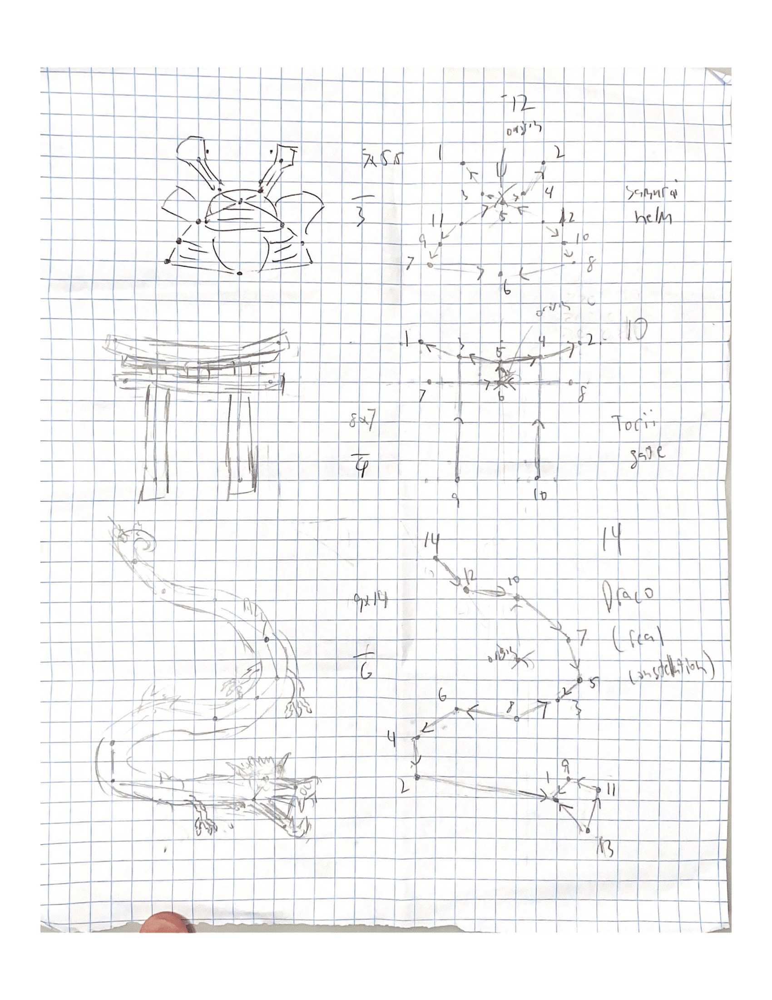

<video width="640" height="360" controls="">
  <source src="MD demo.mp4" type="video/mp4" />
  Your browser does not support the video tag.
</video>

## Overview
- In Master Dancer, you meet the famous dancer Loïe Fuller, the first to integrate technology into modern dance. As a player, you engage in action games to learn her movement principles and, guided by Virtual Loïe, explore her world. You will use modern VR technology to create your own unique dance, becoming a Master Dancer yourself!

## Team Size/Time constraint
- Worked as the lead of design in a team of 9, currently ongoing.

## What I did
- Gameplay Design
- UI design
- Wrote Systems dictionaries
- Wrote Systems Breakdowns
- Wrote Beat-by-Beats
- Created Game Loops
- Made High level Flow charts
- Made Art References/Mockups

## Examples of Work

- Mockup/Art Reference for some of the tutorial systems.
<picture>
  
</picture>

- Mockup of player reward system where they draw constellations as they complete the level
<picture>
  
</picture>

- Flowchart of game loop for a minigame
<picture>
  
</picture>

- Detailed breakdown of minigame
<embed src="D.d.2. Music Game Overview v2.docx - Google Docs.pdf" type="application/pdf" width="892" height="842"/>

