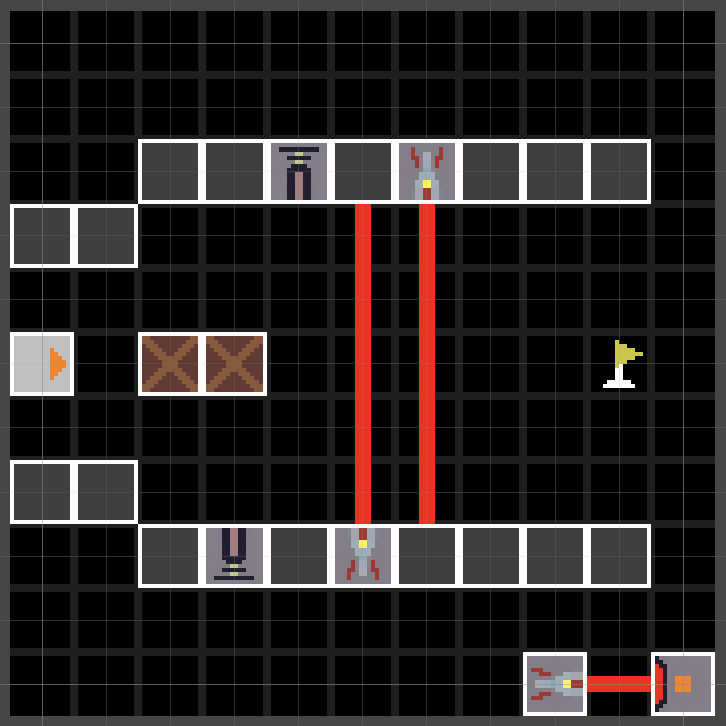

## Overview
- Triplight is a sokoban style 2d turn based puzzle game centering around the idea of lasers. The goal of each level is to reach the flag at the end by passing through lasers, crates and a variety of other obstacles. As you complete levels, more mechanics continue to be gradually added to create a variety of fun, interesting, and challenging levels.

## Team Size/Time constraint
- Was a designer in a team of ~20 over the course of a semester

## What I did
- Level Design
- Adjusted Level Progression
- Playtesting/QA testing
- UI mockups

## Examples of Work

- Level I created

- Spreadsheet of the difficulty of each level
<embed src="Triplight Difficulty.pdf" type="application/pdf" width="900" height="600"/>

- Proposed level order based on level difficulty and content
<embed src="triplight level order.pdf" type="application/pdf" width="900" height="600"/>

