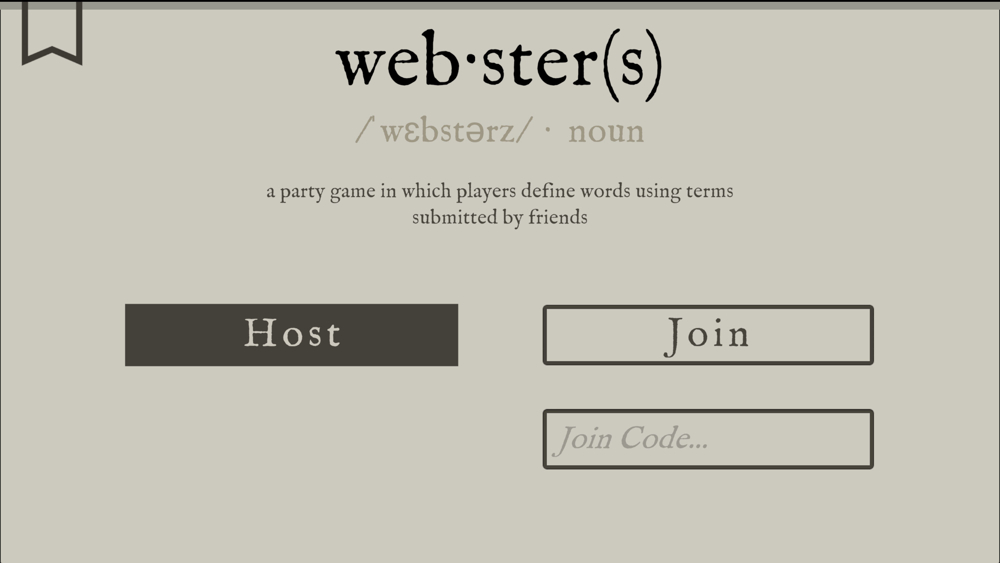

## Link to Game

https://suareal.itch.io/websters

## Team Size/Time constraint
- Main programmer and designer in a team of 2. Made in 2 days for a game jam.

## What I did
- Came up with the core concept and designed the full game loop
- Programmed the vast majority of the game, including:
  - Online multiplayer with FishNet, keeping every player's state, turns, and submissions in sync
  - Round flow through the prompt, define, decoy, and guess phases
  - Building each round's word bank from players' prompt answers plus 10 random dictionary words
  - The definition builder, which restricts the definer to words from the bank
  - Decoy submission, shuffling decoys in with the real word, and guess handling

## Game Overview
- Websters is a Jackbox-style party game about defining a word with words you didn't choose. It's chaotic, it's nearly impossible, and it gets funnier with more players.

## Gameplay Loop
1. **Prompt:** Every player answers a prompt. Their answers become the shared word bank for the round.
2. **Define:** One player picks a secret word and has to describe it using only words from the bank. Ten random dictionary words are thrown in too, to help fill in gaps.
3. **Decoy:** Everyone else reads the description they wrote and writes a decoy/fake word they think fits it.
4. **Guess:** All the decoys are revealed alongside the real word, and everyone tries to pick out the real one.

For example, if my prompt answer was "I really enjoy eating pancakes" and my secret word is *cannibal*, I have to describe a cannibal with "I, really, enjoy, eating, pancakes," plus whatever everyone else wrote and the random words.

<!-- TODO: add a gif of a round being played -->