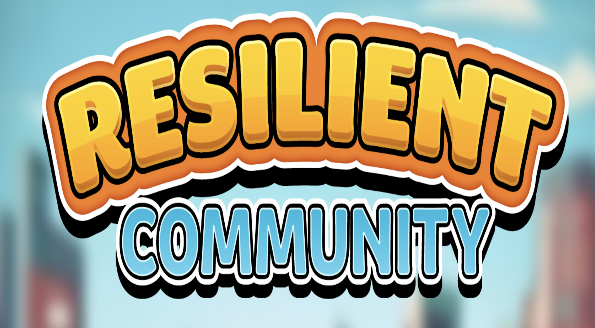

## Overview
- Resilient Community is an educational board game ported to pc. The goal of the game is to keep your community's components safe from hurricanes such that the neighborhoods' power grids stay functional throughout the course of the game.

## Team Size/Time constraint
- Worked as a Designer in a team of 4. Currently ongoing.

## What I did
- UI Mockups
- UX Design
- Sound Design
- Playtesting/QA

<picture>
  
</picture>
