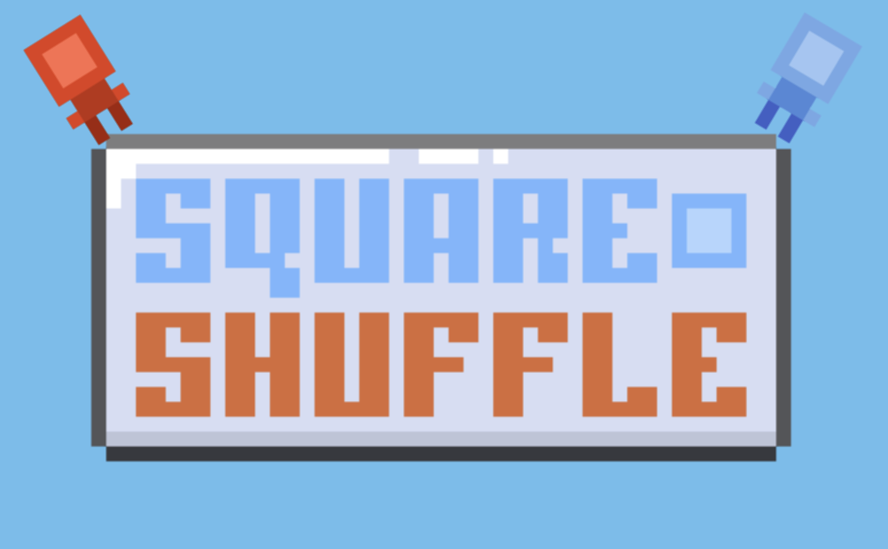

## Overview
- A turn based sokoban style game, alongside some enemies that are trying to kill you. Overall a very simple and barebones game.

## Team Size/Time constraint
- Programmer and level designer in a team of 4. Took 2 weeks to complete.

## What I did
- Level Design
- Playtesting
- Programmed UI

## Link to Game

https://redbluebird.itch.io/square-shuffle
