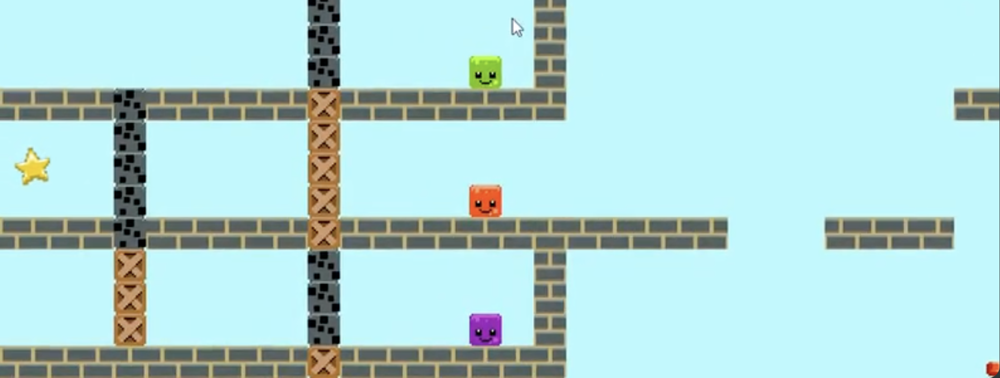

## Overview
- A 2d puzzle platformer where you control 3 separate characters to traverse various levels. These characters can sometimes combine to perform certain actions necessary to complete levels, and at other times must separate to complete multiple tasks at once. Likely broken due to updates to the library.

## Team Size/Time constraint
- Team of 4, Completed in 2 weeks.

## What I did
- Level Design
- Programmed UI
- Programmed Movement/Physics (not including the blocks combining)

## Link to Repo

https://github.com/SimplyNarwall/despacito

## Examples of Work

<video width="640" height="360" controls="">
  <source src="tb.mp4" type="video/mp4" />
  Your browser does not support the video tag.
</video>

<picture>

  
</picture>

